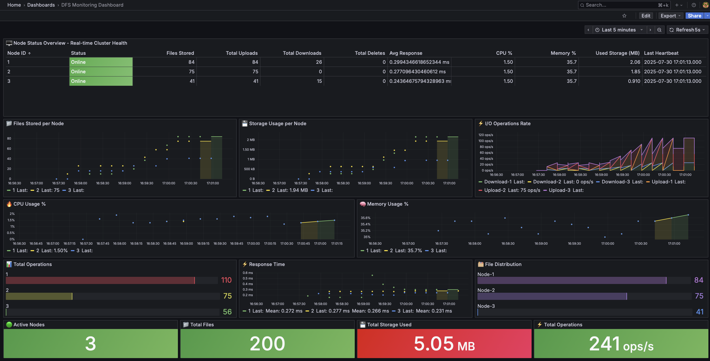

# Distributed File System

A distributed file system just files stored across multiple nodes with monitoring, anomly detection and grafana dashboards

## What it does

- Stores files across multiple storage nodes
- Tracks everything in PostgreSQL 
- REST API for uploads/downloads
- Real-time monitoring with Grafana
- Auto load balancing and replication


## Services will be running on:
- Controller API: http://localhost:8000
- Grafana Dashboard: http://localhost:3000 (admin/admin)
- Storage Node 1: http://localhost:8001  
- Storage Node 2: http://localhost:8002
- Storage Node 3: http://localhost:8003

## Usage

### Upload a file
```bash
curl -X POST "http://localhost:8000/files/upload" \
     -F "uploaded_file=@yourfile.txt"
```

### List files
```bash
curl "http://localhost:8000/files"
```

### Download a file
```bash
curl "http://localhost:8000/files/{file_id}" > downloaded_file.txt
```

### Run the demo simulations
```bash
./scripts/example.sh
```

## Monitoring Dashboard

The system includes a Grafana dashboard showing real-time metrics:

